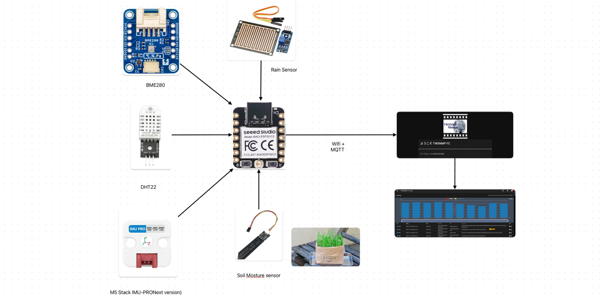
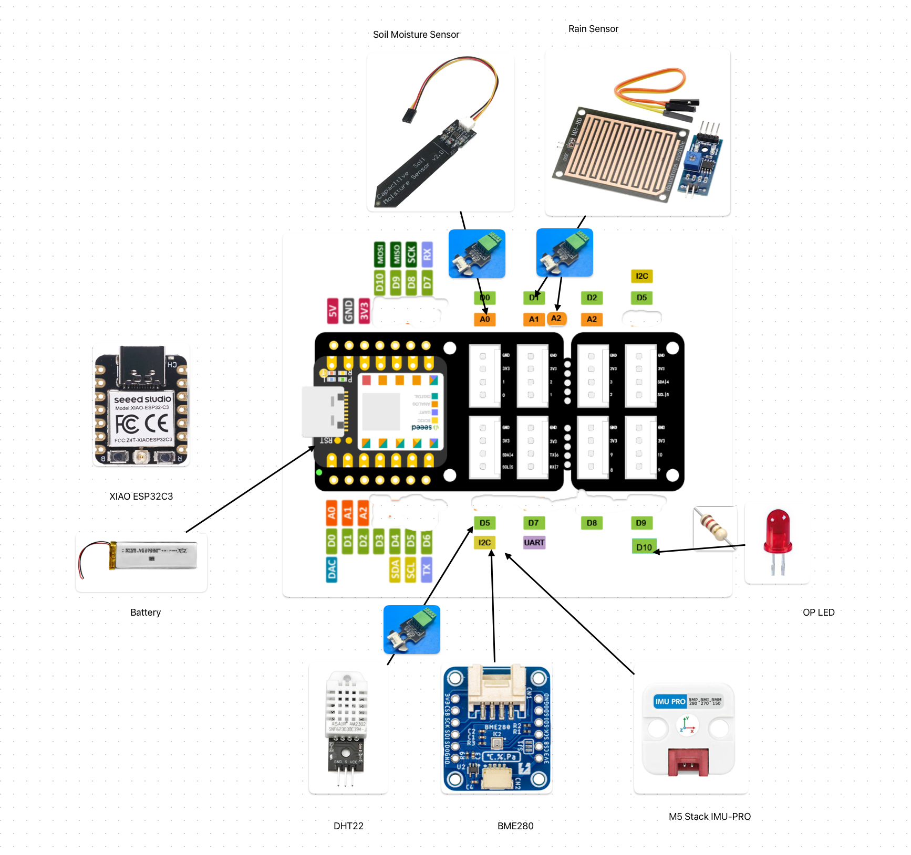

# twESP32Flora
ESP32-based plant monitoring system sending temperature, humidity, soil moisture, and pressure data via MQTT for TWSNMP.





## CLI Tool

The `twESP32FloraCLI` is a command-line tool designed to manage the ESP32 device, including flashing firmware, configuration, and monitoring.

### Usage

```bash
twESP32FloraCLI [options...] command
```

### Commands

*   `list`: List available serial ports.
*   `monitor`: Monitor the serial output from the device.
*   `config`: Configure the ESP32 settings (WiFi, MQTT, Sensors).
*   `write`: Write firmware to the ESP32.
*   `reset`: Reset the ESP32 device.
*   `version`: Show the tool version.

### Options

*   `-esptool string`: Path to `esptool` executable.
*   `-port string`: Serial port name (required for most commands).
*   `-ssid string`: WiFi SSID (required for `config`).
*   `-password string`: WiFi password (required for `config`).
*   `-mqttIP string`: MQTT Broker IP address (required for `config`).
*   `-mqttPort int`: MQTT Broker port (default `1883`).
*   `-interval int`: MQTT send interval in seconds (default `60`).
*   `-sensor string`: Temperature and Humidity sensor type (`DHT22` | `BME280`) (default `"DHT22"`).
*   `-rain`: Indicate if a rain sensor is present (default `false`).

### Operations

#### Writing Firmware

To flash the firmware to the ESP32:

```bash
./twESP32FloraCLI -port /dev/tty.usbserial-xxxxxxxx write
```

This command uses `esptool` to write the binaries (`twESP32Flora.ino.bin`, etc.) to the device.

#### Configuration

To configure the device with WiFi and MQTT settings:

```bash
./twESP32FloraCLI -port /dev/tty.usbserial-xxxxxxxx -ssid "YourSSID" -password "YourPassword" -mqttIP "192.168.1.50" -sensor BME280 config
```

During configuration, the tool handles setting parameters and provides interactive prompts for sensor calibration:
1.  **WiFi & MQTT**: Automatically sends the provided credentials.
2.  **Soil Moisture Calibration**: You will be prompted to remove the sensor (dry) and then place it in water.
3.  **Rain Sensor Calibration**: If `-rain` is enabled, you will be prompted to dry the sensor and then drop water on it.

#### Monitoring

To view the serial output from the device:

```bash
./twESP32FloraCLI -port /dev/tty.usbserial-xxxxxxxx monitor
```

#### Listing Ports

To list connected serial devices:

```bash
./twESP32FloraCLI list
```

## Firmware Specification

### Hardware Connections

The firmware is configured for the following pin assignments (based on XIAO ESP32C3):

| Component | Pin | Note |
| :--- | :--- | :--- |
| **DHT Sensor** | `D5` | DHT22 Temperature & Humidity |
| **Soil Moisture Sensor** | `A0` | Analog Input |
| **Rain Sensor (Digital)** | `D1` | Digital Input |
| **Rain Sensor (Analog)** | `A2` | Analog Input |
| **BOOT Button** | `D9` | Used for factory reset |
| **LED** | `D10` | Status Indicator |
| **BME280** | `SDA`, `SCL` | I2C Interface (Address 0x77 or 0x76) |



### Button Operations

The **BOOT button** (Pin D9) serves a special function:

*   **Factory Reset**: Press and hold the BOOT button for **about 5 seconds**.
    *   The LED will blink while the button is held.
    *   After 5 seconds, the saved configuration (WiFi, MQTT, Calibration data) will be cleared, and the device will restart.
    *   This forces the device back into configuration mode.

### Serial Configuration Mode

If the device is not configured (or after a factory reset), it enters **Configuration Mode** on startup. You can configure it manually via a serial terminal (baud rate 115200) if not using the CLI tool.

1.  **Enter SSID**: Type the WiFi SSID.
2.  **Enter Password**: Type the WiFi password.
3.  **Enter MQTT IP**: Type the IP address of the MQTT Broker.
4.  **Enter MQTT Port**: Type the port number (default `1883`).
5.  **Enter Monitor Interval**: Type the interval in seconds (default `60`).
6.  **Enter Sensor Type**: Choose `DHT22` or `BME280`.
7.  **Rain Sensor?**: Type `yes` or `no`.
8.  **Calibration**: Follow the on-screen prompts to calibrate the Soil Moisture and Rain sensors (measure dry and wet values).

## Build

To build the project (CLI tool and Firmware) from source, you need the following tools installed:

*   **[Go](https://go.dev/)**: Required to build the CLI tool.
*   **[Task](https://taskfile.dev/)**: A task runner / build tool used to automate the build process.
*   **[Arduino CLI](https://arduino.github.io/arduino-cli/)**: Required to compile the ESP32 firmware.

### Build Instructions

1.  Install the prerequisites listed above.
2.  Open a terminal in the project root directory.
3.  Run the following command:

    ```bash
    task
    ```

This command will automatically:
1.  Build the CLI tool for Windows (`.exe`) and macOS (`amd64` & `arm64`).
2.  Compile the firmware for the XIAO ESP32C3 board using `arduino-cli`.
3.  Package the binaries and firmware into a zip file located in the `dist/` directory.

To clean up the build artifacts, run:

```bash
task clean
```