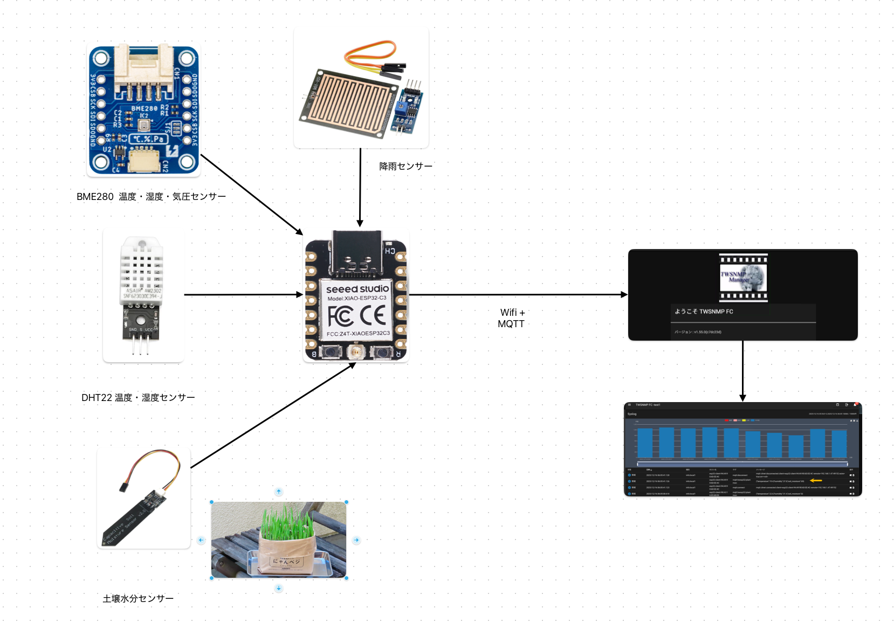
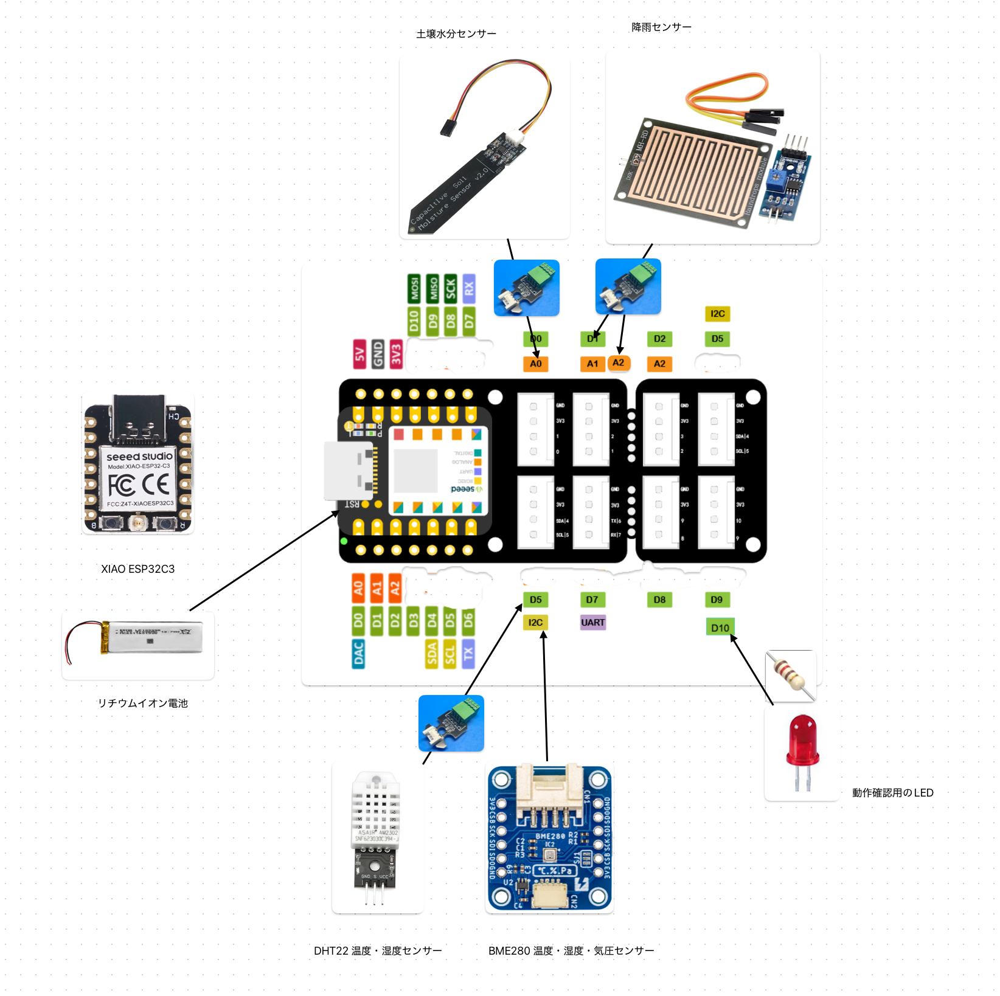

# twESP32Flora
TWSNMP向けに、温度、湿度、土壌水分、気圧データをMQTT経由で送信するESP32ベースの植物モニターシステムです。




## CLIツール

`twESP32FloraCLI` は、ファームウェアの書き込み、設定、モニターなど、ESP32デバイスを管理するために設計されたコマンドラインツールです。

### 使い方

```bash
twESP32FloraCLI [オプション...] コマンド
```

### コマンド

*   `list`: 利用可能なシリアルポートを一覧表示します。
*   `monitor`: デバイスからのシリアル出力をモニターします。
*   `config`: ESP32の設定（WiFi、MQTT、センサー）を行います。
*   `write`: ESP32にファームウェアを書き込みます。
*   `reset`: ESP32デバイスをリセットします。
*   `version`: ツールのバージョンを表示します。

### オプション

*   `-esptool string`: `esptool` 実行ファイルへのパス。
*   `-port string`: シリアルポート名（ほとんどのコマンドで必須）。
*   `-ssid string`: WiFi SSID（`config` で必須）。
*   `-password string`: WiFi パスワード（`config` で必須）。
*   `-mqttIP string`: MQTTブローカーのIPアドレス（`config` で必須）。
*   `-mqttPort int`: MQTTブローカーのポート（デフォルト `1883`）。
*   `-interval int`: MQTT送信間隔（秒単位）（デフォルト `60`）。
*   `-sensor string`: 温湿度センサーのタイプ（`DHT22` | `BME280`）（デフォルト `"DHT22"`）。
*   `-rain`: 雨センサーが存在するかどうか（デフォルト `false`）。

### 操作

#### ファームウェアの書き込み

ESP32にファームウェアを書き込むには：

```bash
./twESP32FloraCLI -port /dev/tty.usbserial-xxxxxxxx write
```

このコマンドは `esptool` を使用して、バイナリ（`twESP32Flora.ino.bin` など）をデバイスに書き込みます。

#### 設定

WiFiとMQTTの設定を行うには：

```bash
./twESP32FloraCLI -port /dev/tty.usbserial-xxxxxxxx -ssid "YourSSID" -password "YourPassword" -mqttIP "192.168.1.50" -sensor BME280 config
```

設定中、ツールはパラメータの設定を行い、センサーのキャリブレーションのための対話型プロンプトを提供します：
1.  **WiFi & MQTT**: 提供された認証情報を自動的に送信します。
2.  **土壌水分センサーのキャリブレーション**: センサーを（乾いた状態で）取り外し、その後水に浸すように促されます。
3.  **雨センサーのキャリブレーション**: `-rain` が有効な場合、センサーを乾燥させ、その後水を滴下するように促されます。

#### モニター

デバイスからのシリアル出力を表示するには：

```bash
./twESP32FloraCLI -port /dev/tty.usbserial-xxxxxxxx monitor
```

#### ポート一覧

接続されているシリアルデバイスを一覧表示するには：

```bash
./twESP32FloraCLI list
```

## ファームウェア仕様

### ハードウェア接続

ファームウェアは以下のピン割り当て（XIAO ESP32C3に基づく）で構成されています：

| コンポーネント | ピン | 備考 |
| :--- | :--- | :--- |
| **DHTセンサー** | `D5` | DHT22 温度・湿度 |
| **土壌水分センサー** | `A0` | アナログ入力 |
| **雨センサー (デジタル)** | `D1` | デジタル入力 |
| **雨センサー (アナログ)** | `A2` | アナログ入力 |
| **BOOTボタン** | `D9` | ファクトリーリセットに使用 |
| **LED** | `D10` | ステータスインジケーター |
| **BME280** | `SDA`, `SCL` | I2Cインターフェース (アドレス 0x77 または 0x76) |





### ボタン操作

**BOOTボタン**（ピン D9）には特別な機能があります：

*   **ファクトリーリセット**: BOOTボタンを **約5秒間** 長押しします。
    *   ボタンを押している間、LEDが点滅します。
    *   5秒後、保存された設定（WiFi、MQTT、キャリブレーションデータ）が消去され、デバイスが再起動します。
    *   これにより、デバイスは強制的に設定モードに戻ります。

### シリアル設定モード

デバイスが設定されていない場合（またはファクトリーリセット後）、起動時に **設定モード** に入ります。CLIツールを使用しない場合は、シリアルターミナル（ボーレート 115200）を使用して手動で設定できます。

1.  **SSIDを入力**: WiFiのSSIDを入力します。
2.  **パスワードを入力**: WiFiのパスワードを入力します。
3.  **MQTT IPを入力**: MQTTブローカーのIPアドレスを入力します。
4.  **MQTTポートを入力**: ポート番号を入力します（デフォルト `1883`）。
5.  **モニター間隔を入力**: 間隔を秒単位で入力します（デフォルト `60`）。
6.  **センサータイプを入力**: `DHT22` または `BME280` を選択します。
7.  **雨センサー?**: `yes` または `no` を入力します。
8.  **キャリブレーション**: 画面の指示に従って、土壌水分センサーと雨センサーのキャリブレーションを行います（乾燥時と湿潤時の値を測定）。

## ビルド

ソースからプロジェクト（CLIツールとファームウェア）をビルドするには、以下のツールがインストールされている必要があります：

*   **[Go](https://go.dev/)**: CLIツールのビルドに必要です。
*   **[Task](https://taskfile.dev/)**: ビルドプロセスを自動化するためのタスクランナー/ビルドツールです。
*   **[Arduino CLI](https://arduino.github.io/arduino-cli/)**: ESP32ファームウェアのコンパイルに必要です。

### ビルド手順

1.  上記の前提条件をインストールします。
2.  プロジェクトのルートディレクトリでターミナルを開きます。
3.  以下のコマンドを実行します：

    ```bash
    task
    ```

このコマンドは自動的に以下を行います：
1.  Windows (`.exe`) および macOS (`amd64` & `arm64`) 用のCLIツールをビルドします。
2.  `arduino-cli` を使用して XIAO ESP32C3 ボード用のファームウェアをコンパイルします。
3.  バイナリとファームウェアをパッケージ化し、`dist/` ディレクトリ内のzipファイルにまとめます。

ビルド成果物を削除するには、以下を実行します：

```bash
task clean
```

## Copyright

see [LiCENSE](./LICENSE)

```
Copyright 2025 Masayuki Yamai
```
